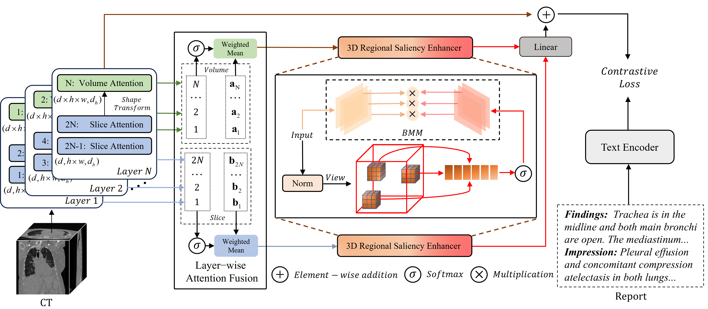

# REAF: A Region-Enhanced volume-slice Hierarchical Attention Fusion Vision-Language Model for CT-Report Retrieval

<div align="center">

[](https://www.python.org/downloads/)
[](https://pytorch.org/)
[](LICENSE)

*REAF: A Region-Enhanced volume-slice Hierarchical Attention Fusion Vision-Language Model for CT-Report Retrieval*

</div>


## 🔍 Overview

In 3D image-text pretraining with radiology reports and corresponding CT scans as supervisory signals, capturing both **global significance at the scan level** and **local significance at the slice level** simultaneously is key to determining the model's alignment performance. 

Most existing volume modeling methods based on ViT typically encode the entire CT scan sequentially and learn global features through a simple attention mechanism, neglecting the inherent slice-level local information in CT data and lacking a dedicated hierarchical feature aggregation mechanism. Some studies attempt to bridge the granularity gap through inter-slice and inter-scan interactions, but they overlook the spatial saliency that CT data inherently contains.

To address this, we propose **REAF (Region-Enhanced Scan-Slice Hierarchical Attention Fusion Pretraining)**. In addition to the slice-scan interaction framework, we introduce:
- **Scan-Slice-level Layer-wise Attention Fusion** mechanism for in-layer fusion
- **3D Regional Saliency Enhancer** mechanism to identify high-saliency sub-blocks within the 3D region and enhance or suppress them accordingly

This model is end-to-end trained in a **CLIP-style cross-modal contrastive learning framework**.

## 🏗️ Architecture

<div align="center">

</div>


## 🛠️ Installation

### Prerequisites

- Python 3.10+
- CUDA 11.8+ (for GPU support)
- 16GB+ GPU memory recommended

### Environment Setup

```bash
# Clone the repository
git clone https://github.com/your-username/REAF.git
cd REAF

# Create conda environment
conda create -n REAF python=3.10
conda activate REAF

# Install PyTorch (adjust cuda version as needed)
pip install torch torchvision torchaudio --index-url https://download.pytorch.org/whl/cu118

# Install dependencies
pip install -r requirements.txt

# Install open_clip and open_clip_train
# (Assuming these are custom dependencies, adjust as needed)
pip install open-clip-torch
```

### Required Dependencies

Core dependencies include:
```
torch>=2.0.0
torchvision>=0.15.0
timm>=0.9.0
transformers>=4.30.0
numpy>=1.24.0
pandas>=2.0.0
wandb>=0.15.0
```

---

## 📦 Dataset Preparation

### CT-RATE Dataset

This project uses the **CT-RATE** dataset for training and evaluation. 

#### Data Structure

Organize your data in the following structure:

```
/path/to/ct_rate/
├── train/
│   ├── volumes/          # CT scan volumes
│   │   ├── case_001.pt   # Preprocessed CT volume
│   │   ├── case_002.pt
│   │   └── ...
│   └── reports/          # Radiology reports
│       └── reports.json
├── val/
│   ├── volumes/
│   └── reports/
└── test/
    ├── volumes/
    └── reports/
```

#### Data Preprocessing

The project supports multiple data input formats:

- `stage1`: Uncompressed PT files
- `stage2`: Compressed GZ files (default)
- `ori`: Process from original NIfTI files

Configure the data type using `--input-data-type` argument.

#### Preprocessing Parameters

CT scans are preprocessed with windowing:
```bash
--input-info -1150 350 crop
```
- Min HU: -1150
- Max HU: 350
- Mode: crop

---

## 🚀 Training

### Quick Start

```bash
bash train_ghs.sh
```

### Custom Training

```bash
python main.py \
  --model vit_base_singlescan_h2_token2744 \
  --data-root /path/to/ct_rate \
  --train-data /path/to/ct_rate/train \
  --val-data /path/to/ct_rate/val \
  --zeroshot-ct-rate /path/to/ct_rate/test \
  --batch-size 16 \
  --epochs 50 \
  --lr 5e-4 \
  --warmup 2 \
  --workers 8 \
  --precision amp \
  --grad-checkpointing \
  --fusion-method weighted_mean \
  --use-cxr-bert \
  --cxr-bert-path /path/to/cxr-bert \
  --wandb-project-name REAF \
  --name REAF_experiment \
  --logs ./logs
```


### Distributed Training

```bash
# Multi-GPU training with torch.distributed
torchrun --nproc_per_node=4 main.py \
  --model vit_base_singlescan_h2_token2744 \
  --data-root /path/to/ct_rate \
  --batch-size 16 \
  --epochs 50 \
  --precision amp
```


---

## 📊 Evaluation

### Zero-shot Evaluation

```bash
python zero_shot.py \
  --model vit_base_singlescan_h2_token2744 \
  --resume /path/to/checkpoint.pt \
  --zeroshot-ct-rate /path/to/ct_rate/test \
  --use-cxr-bert \
  --cxr-bert-path /path/to/cxr-bert
```


